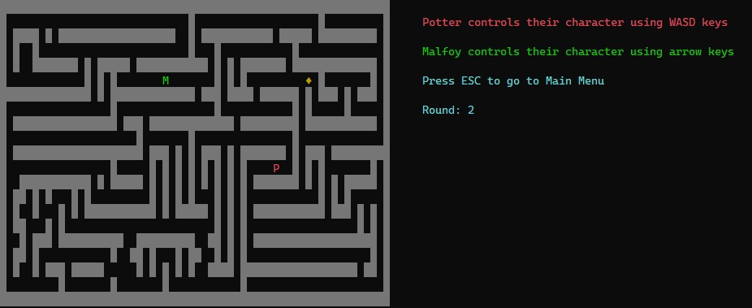

# Maze Game with NCurses

This repository contains a two-player maze game created in C++ using the NCurses library. In this game, two players navigate through a maze loaded from a text file. One player uses WASD keys, the other uses arrow keys to find and catch a randomly teleporting gemstone. The first player who successfully captures the gemstone wins the game.

## Game Preview



## Prerequisites

Before running the game, make sure you have the following prerequisites:
- Linux or macOS operating system
- C++ compiler (e.g., g++)
- NCurses library

### Linux (e.g., Ubuntu, Debian) :
```bash
sudo apt-get install libncurses5-dev
```
### macOS :
```bash
brew install ncurses
```
## Getting Started

1. **Compile the Game:**
   ```shell
   g++ *.cpp -o maze_game -lncurses
   ```
2. **Run the Game:**
   ```shell
   ./maze_game <map_filepath>
   ```
## Maze Map
The maze map is loaded from a text file provided as a command-line argument when starting the game. The map file should use the following characters:

- '*' represents walls.
- '.' represents open spaces/passages.
  
You can use the provided map files (e.g., Map1.txt and Map2.txt), or create your own custom map text files by following the same format.

## License
This project is licensed under the MIT License - see the LICENSE file for details.
